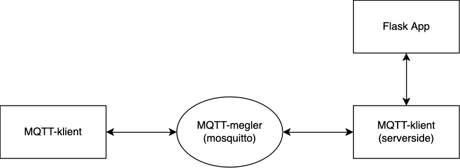
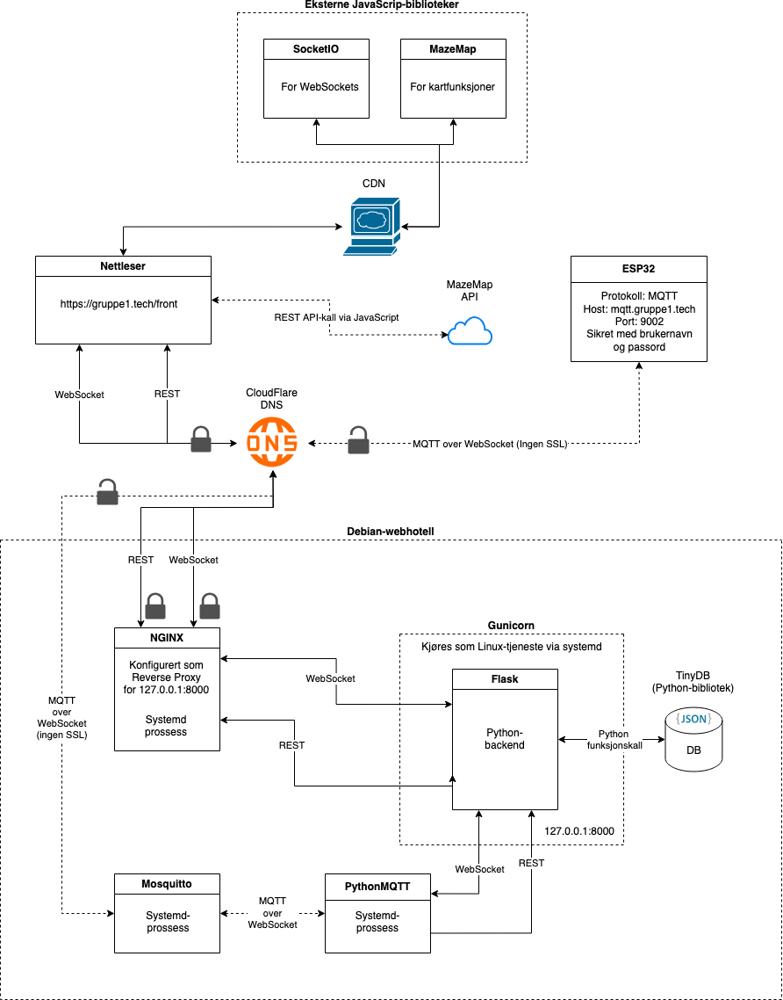

Systemoversikt
===============

Løsningen er implementert i henhold til figuren:

   Overblikk av MQTT-systemet.

Her ser vi et overblikk over hvordan MQTT kommunikasjonen er implementert.

Detaljert beskrivelse
----------------

Nednefor kan man observere i større grad hvordan de forskjellige delene
av systemet henger sammen.

   Detaljert overblikk av WebServeren.

Flask-app
----------

Python-biblioteket Flask ble brukt som rammeverk for å sette opp nettsiden. 
Denne løsningen egner seg godt til prototyping da det tillater rask utvikling av nettsider. 
Se `flask.palletsprojects.com <https://flask.palletsprojects.com/en/stable/>`_ for mer informasjon.
Hver modul er definert i sin egen python-fil i app-mappen.

.. toctree::
   :maxdepth: 2

   modules

MQTT
-----
.. toctree::
   :maxdepth: 1

   mqttclient

Omvendt proxy (NGINX)
----------------------
.. toctree::
   :maxdepth: 2

   nginx

Systemd
--------
.. toctree::
   :maxdepth: 2

   services

Byggskript
-----------

.. toctree::
   :maxdepth: 2

   build

Avhengigheter
-------------

.. toctree::
   :maxdepth: 2

   dependencies